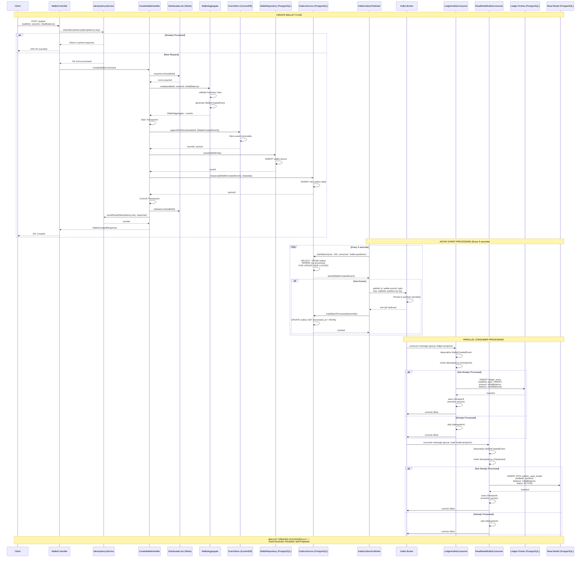
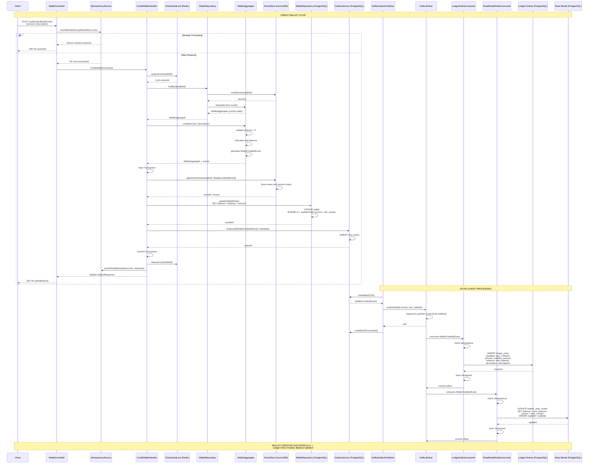
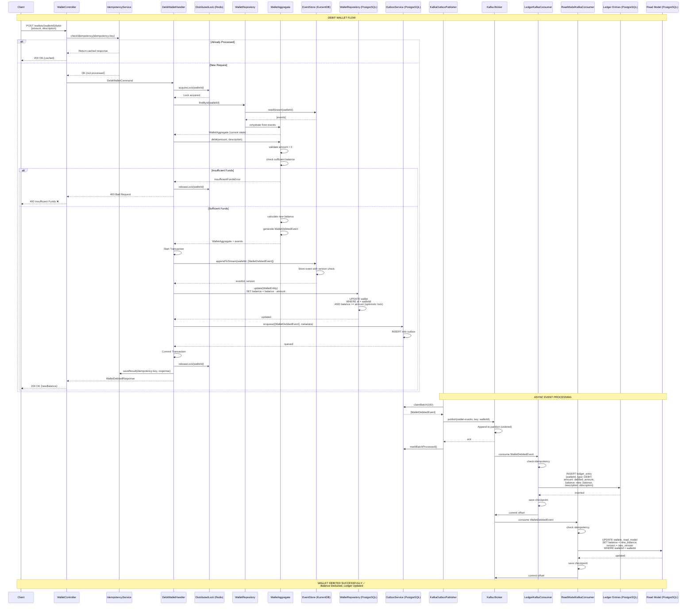
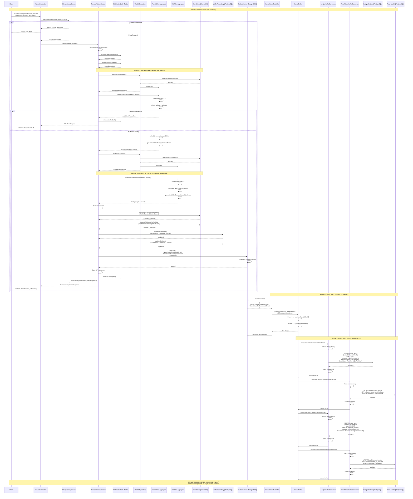

# Wallex System - Complete Sequence Diagrams with Kafka

This document contains detailed sequence diagrams for all wallet operations in the Kafka-based event-driven architecture.

## Table of Contents
1. [Create Wallet Flow](#1-create-wallet-flow)
2. [Credit Wallet Flow](#2-credit-wallet-flow)
3. [Debit Wallet Flow](#3-debit-wallet-flow)
4. [Transfer Wallet Flow](#4-transfer-wallet-flow)

---

## 1. Create Wallet Flow



### Create Wallet Flow Description

**Synchronous Phase (Client Request):**
1. Client sends POST request with wallet details
2. Idempotency check prevents duplicate processing
3. Distributed lock acquired for wallet
4. Wallet aggregate validates and generates event
5. **Transaction commits atomically**:
   - Event saved to KurrentDB (event store)
   - Wallet entity saved to PostgreSQL (write model)
   - Event enqueued to outbox table
6. Response returned to client (201 Created)

**Asynchronous Phase (Event Processing):**
7. Kafka publisher polls outbox every 5 seconds
8. Events published to Kafka topic with wallet partition key
9. **Two parallel consumers process independently**:
   - **Ledger Consumer**: Creates ledger entry with initial balance
   - **Read Model Consumer**: Creates read model record
10. Each consumer maintains its own checkpoint for idempotency

---

## 2. Credit Wallet Flow



### Credit Wallet Flow Description

**Synchronous Phase:**
1. Client sends credit request with amount
2. Idempotency check prevents duplicate credits
3. Lock acquired to prevent concurrent modifications
4. **Aggregate rehydration**: Load all events from event store
5. Business rule validation (amount > 0)
6. **Atomic transaction**:
   - Append WalletCreditedEvent to event store
   - Update balance in write model
   - Enqueue event to outbox
7. Return updated balance to client

**Asynchronous Phase:**
8. Event published to Kafka with wallet partition key
9. **Ledger Consumer**: Creates CREDIT entry in ledger
10. **Read Model Consumer**: Updates wallet balance in read model
11. Both consumers ensure idempotency with checkpoints

---

## 3. Debit Wallet Flow



### Debit Wallet Flow Description

**Synchronous Phase:**
1. Client sends debit request with amount
2. Idempotency check prevents duplicate debits
3. Lock acquired for wallet
4. Aggregate rehydrated from event store
5. **Critical validation**: Check sufficient balance
   - If insufficient: Return 400 error immediately
   - If sufficient: Proceed with debit
6. **Atomic transaction**:
   - Append WalletDebitedEvent to event store
   - Decrease balance in write model with optimistic lock
   - Enqueue event to outbox
7. Return new balance to client

**Asynchronous Phase:**
8. Event published to Kafka
9. **Ledger Consumer**: Creates DEBIT entry
10. **Read Model Consumer**: Updates balance
11. Idempotency ensures no duplicate processing

---

## 4. Transfer Wallet Flow



### Transfer Wallet Flow Description

**Synchronous Phase (2-Phase Transfer):**
1. Client sends transfer request with source, destination, amount
2. Idempotency check prevents duplicate transfers
3. **Deadlock prevention**: Lock both wallets in sorted order
4. **Phase 1 - Initiate Transfer**:
   - Load source wallet aggregate
   - Validate sufficient balance
   - Generate WalletTransferInitiatedEvent (debit)
5. **Phase 2 - Complete Transfer**:
   - Load destination wallet aggregate
   - Generate WalletTransferCompletedEvent (credit)
6. **Atomic transaction** (both wallets):
   - Append 2 events to event store (different streams)
   - Update both wallet balances in write model
   - Enqueue both events to outbox
7. Release both locks
8. Return both new balances to client

**Asynchronous Phase (2 Events):**
9. Publisher publishes both events to Kafka
   - Event 1 → partition based on fromWalletId
   - Event 2 → partition based on toWalletId
10. **Ledger Consumer** processes both events:
    - Creates DEBIT entry for source wallet
    - Creates CREDIT entry for destination wallet
11. **Read Model Consumer** processes both events:
    - Updates source wallet balance
    - Updates destination wallet balance
12. All operations are idempotent and can be replayed

---

## System Architecture Overview

### Key Components

| Component          | Technology   | Purpose                                  |
| ------------------ | ------------ | ---------------------------------------- |
| **Event Store**    | KurrentDB    | Single source of truth, immutable events |
| **Message Broker** | Apache Kafka | Reliable event distribution, ordering    |
| **Write Model**    | PostgreSQL   | Current state for commands               |
| **Read Model**     | PostgreSQL   | Optimized for queries                    |
| **Ledger**         | PostgreSQL   | Audit trail, transaction history         |
| **Outbox**         | PostgreSQL   | Transactional outbox pattern             |
| **Cache**          | Redis        | Idempotency, distributed locks           |

### Event Flow Guarantees

✅ **Atomicity**: All or nothing (transaction boundary)
✅ **Consistency**: Business rules enforced in aggregates
✅ **Isolation**: Distributed locks prevent concurrent modifications
✅ **Durability**: Events persisted to event store + Kafka
✅ **Ordering**: Events for same wallet always in order (partition key)
✅ **Idempotency**: No duplicate processing (checkpoints)
✅ **Reliability**: At-least-once delivery with Kafka
✅ **Scalability**: 10 Kafka partitions, parallel consumers

### Error Handling

- **Insufficient Funds**: Validated in aggregate, returns 400
- **Duplicate Request**: Idempotency key returns cached response
- **Concurrent Modification**: Optimistic locking + version check
- **Event Processing Failure**: Automatic retry with exponential backoff
- **Dead Letter Queue**: Failed messages sent to DLQ after max retries
- **System Crash**: Events replayed from Kafka on recovery

---

## Performance Characteristics

### Synchronous Operations (Command Side)

- **Create Wallet**: ~50-100ms
- **Credit/Debit**: ~50-100ms
- **Transfer**: ~100-150ms (2 wallets)

### Asynchronous Processing (Event Side)

- **Outbox to Kafka**: ~5 seconds (polling interval)
- **Kafka to Consumers**: ~10-100ms (near real-time)
- **Total Eventual Consistency**: ~5-10 seconds

### Throughput

- **Commands**: ~200-300 ops/second
- **Events Published**: ~100-200 events/second
- **Events Consumed**: ~500-1000 events/second (parallel)

### Scalability

- **Horizontal Scaling**: Add more consumer instances
- **Partition Count**: 10 partitions = up to 10 parallel consumers
- **Load Distribution**: Automatic via Kafka consumer groups

---

## Monitoring Points

### Health Checks

```bash
# Overall system health
curl http://localhost:3000/health/kafka

# Kafka producer health
curl http://localhost:3000/health/kafka/stats
```

### Key Metrics to Monitor

1. **Command Processing Time** (p50, p95, p99)
2. **Outbox Lag** (age of oldest unprocessed event)
3. **Kafka Consumer Lag** (per partition, per consumer group)
4. **Event Processing Time** (per consumer)
5. **Error Rate** (per operation type)
6. **Throughput** (ops/second)

### Kafka UI

Access http://localhost:8080 to monitor:
- Topics and partitions
- Consumer groups and lag
- Message flow and throughput
- Partition distribution

---

## Best Practices

### For High Reliability

1. ✅ Always use idempotency keys
2. ✅ Validate in aggregates before persistence
3. ✅ Use distributed locks for concurrent operations
4. ✅ Monitor consumer lag
5. ✅ Set up alerts for high lag (> 1000 messages)

### For High Performance

1. ✅ Batch event publishing (100 events/batch)
2. ✅ Use appropriate partition count (10 partitions)
3. ✅ Tune consumer batch sizes
4. ✅ Enable compression (GZIP)
5. ✅ Optimize database queries

### For Scalability

1. ✅ Add more consumer instances (horizontal scaling)
2. ✅ Increase partition count for topics
3. ✅ Use read models for queries (CQRS)
4. ✅ Cache frequently accessed data
5. ✅ Separate read and write workloads

---

**Status:** ✅ Production Ready | **Version:** 1.0.0 | **Date:** October 29, 2025

