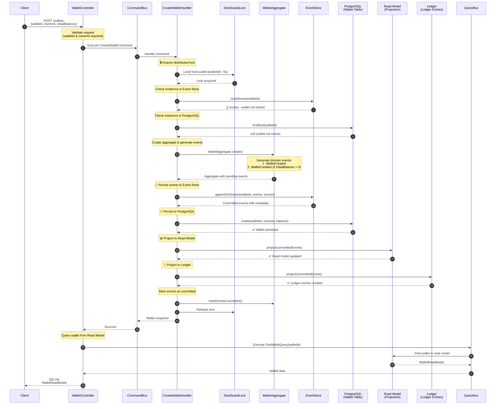
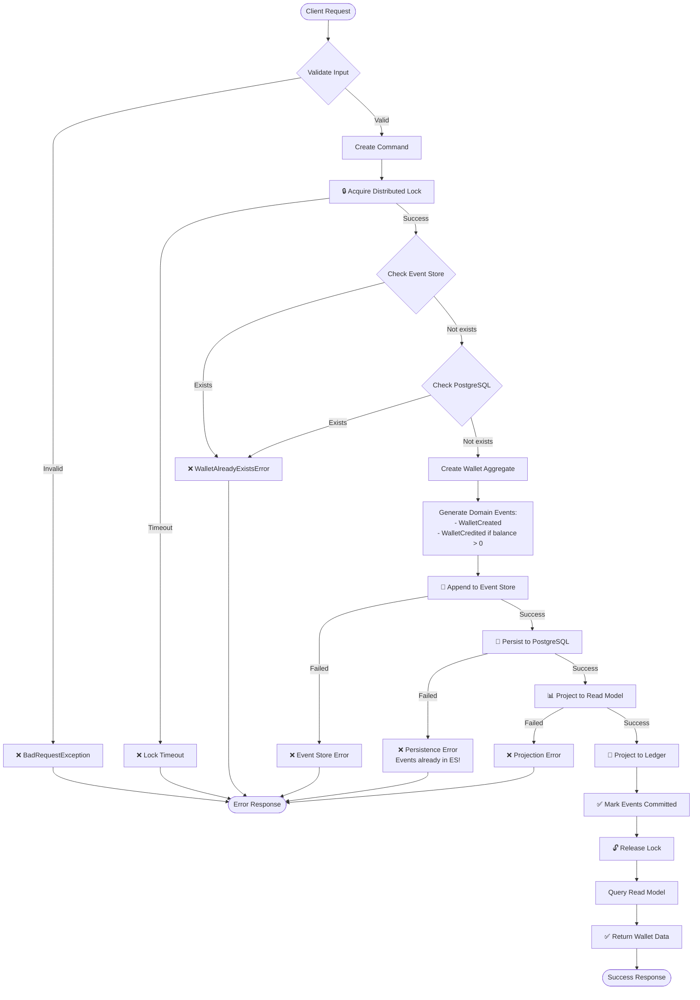
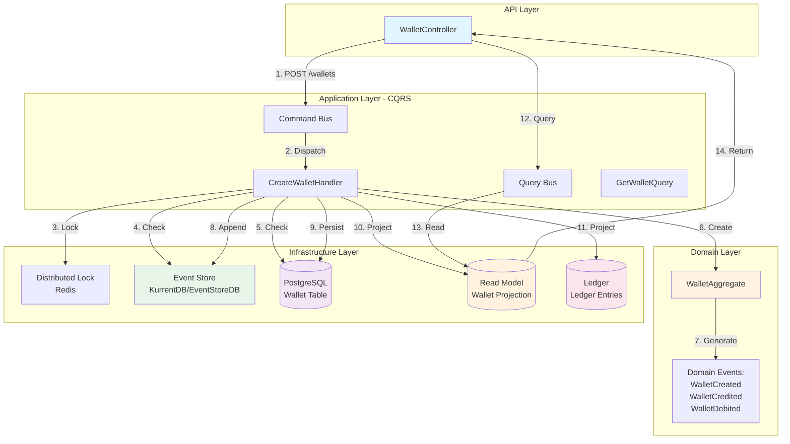

# Diagram Flow Tạo Tài Khoản Wallet

## 🎯 Tổng Quan

Hệ thống sử dụng kiến trúc **Event Sourcing + CQRS** để quản lý wallet. Khi tạo một wallet mới, hệ thống sẽ trải qua **10 bước chính** với sự tham gia của nhiều component khác nhau.

---

## 📊 Sequence Diagram - Flow Chi Tiết



---

## 🔄 Flow Chart - Luồng Xử Lý



---

## 🏗️ Architecture Components Diagram



---

## 📝 Chi Tiết 10 Bước Xử Lý

### **Bước 1: Client Request**
- Client gửi POST request đến `/wallets`
- Body: `{ walletId, ownerId, initialBalance? }`
- Controller validate input (walletId và ownerId bắt buộc)

### **Bước 2: Create Command**
- Tạo `CreateWalletCommand` với walletId, ownerId, initialBalance (default = 0)
- CommandBus dispatch command đến Handler

### **Bước 3: Acquire Distributed Lock** 🔒
- Sử dụng Redis distributed lock
- Lock key: `lock:wallet:{walletId}`
- TTL: 5 giây
- Mục đích: Đảm bảo không có 2 request tạo cùng 1 wallet đồng thời

### **Bước 4: Check Event Store**
- Đọc event stream từ Event Store (KurrentDB)
- Nếu có events → Wallet đã tồn tại → Throw `WalletAlreadyExistsError`
- Event Store là **source of truth**

### **Bước 5: Check PostgreSQL**
- Kiểm tra wallet có tồn tại trong database không
- Double check để đảm bảo consistency
- Nếu tồn tại → Throw `WalletAlreadyExistsError`

### **Bước 6: Create Aggregate**
- Tạo `WalletAggregate` mới
- Validate initialBalance >= 0
- Aggregate là nơi chứa business logic

### **Bước 7: Generate Domain Events**
- **Event 1**: `WalletCreated` - Luôn được tạo
  - Data: `{ ownerId, initialBalance }`
- **Event 2**: `WalletCredited` - Chỉ tạo nếu initialBalance > 0
  - Data: `{ amount: initialBalance, description: "Initial balance" }`

### **Bước 8: Append to Event Store** 📝
- Lưu events vào Event Store với version control
- Events được append với metadata:
  - version
  - occurredAt (timestamp)
  - correlationId, causationId
- **Quan trọng**: Đây là điểm không thể rollback!

### **Bước 9: Persist to PostgreSQL** 💾
- Insert wallet vào bảng `wallets`
- Columns: id, owner_id, balance, created_at, updated_at
- Nếu fail: Log error nhưng events đã ở Event Store (source of truth)

### **Bước 10a: Project to Read Model** 📊
- Cập nhật Read Model (optimized for queries)
- Read Model là denormalized data
- Dùng cho các query GET /wallets

### **Bước 10b: Project to Ledger** 📒
- Tạo ledger entries từ events
- Tracking balance before/after
- Audit trail cho mọi thay đổi

---

## 🔑 Key Concepts

### **Event Sourcing**
- Events là single source of truth
- Mọi thay đổi đều được lưu dưới dạng events
- Có thể rebuild state từ events

### **CQRS (Command Query Responsibility Segregation)**
- **Write Side**: Commands → Aggregate → Events → Event Store
- **Read Side**: Queries → Read Model (optimized)
- Tách biệt logic write và read

### **Distributed Lock**
- Đảm bảo consistency trong môi trường distributed
- Tránh race condition khi tạo wallet
- TTL ngắn (5s) để tránh deadlock

### **Eventual Consistency**
- Event Store write thành công → Success
- Projections (Read Model, Ledger) có thể failed
- Hệ thống eventually consistent

---

## 🛡️ Error Handling

| Error Type                 | HTTP Status | Khi Nào Xảy Ra                           |
| -------------------------- | ----------- | ---------------------------------------- |
| `BadRequestException`      | 400         | Missing walletId/ownerId, invalid amount |
| `WalletAlreadyExistsError` | 409         | Wallet đã tồn tại                        |
| `EventConcurrencyError`    | 409         | Version conflict                         |
| `NotFoundException`        | 404         | Query wallet không tồn tại               |

---

## 📊 Data Flow

```
┌─────────────┐         ┌──────────────┐         ┌─────────────┐
│   Client    │────────>│ WalletCtrl   │────────>│ CommandBus  │
└─────────────┘         └──────────────┘         └─────────────┘
                                                         │
                                                         v
┌─────────────────────────────────────────────────────────────┐
│                    CreateWalletHandler                      │
│  1. Lock  2. Check  3. Create  4. Persist  5. Project      │
└─────────────────────────────────────────────────────────────┘
      │         │         │          │           │
      v         v         v          v           v
   Redis   EventStore  Aggregate  PostgreSQL  Projections
   (Lock)   (Events)   (Logic)    (Data)      (ReadModel+Ledger)
```

---

## 🎯 Summary

**Tổng số bước:** 10 bước chính

**Components tham gia:**
1. ✅ WalletController (REST API)
2. ✅ CommandBus (CQRS)
3. ✅ CreateWalletHandler (Application Service)
4. ✅ DistributedLock (Redis)
5. ✅ WalletAggregate (Domain)
6. ✅ EventStore (KurrentDB)
7. ✅ WalletRepository (PostgreSQL)
8. ✅ WalletProjection (Read Model)
9. ✅ LedgerProjection (Audit Log)
10. ✅ QueryBus (CQRS Read)

**Time Complexity:** ~100-200ms cho toàn bộ flow (tùy thuộc network và DB latency)

**Consistency Model:** Eventual Consistency với Event Store là source of truth

---

## 🔧 Technical Stack

- **Framework**: NestJS
- **CQRS**: @nestjs/cqrs
- **Event Store**: KurrentDB / EventStoreDB
- **Database**: PostgreSQL (TypeORM)
- **Lock**: Redis Distributed Lock
- **Architecture**: Event Sourcing + CQRS + DDD

---

## 📖 Related Documentation

- [LEDGER-EVENT-DRIVEN-ARCHITECTURE.md](LEDGER-EVENT-DRIVEN-ARCHITECTURE.md)
- [IMPLEMENTATION-SUMMARY.md](IMPLEMENTATION-SUMMARY.md)
- [CONCURRENCY-STRATEGY.md](CONCURRENCY-STRATEGY.md)


