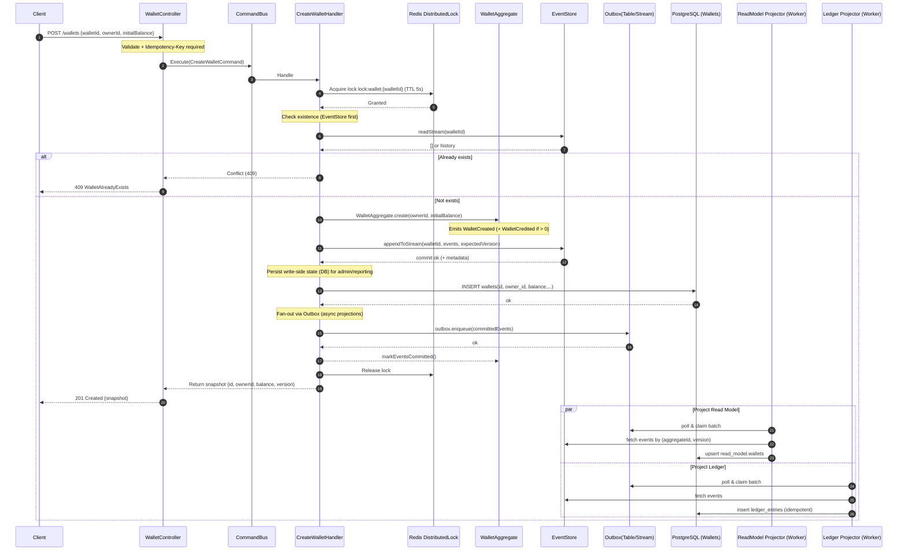

# Wallet Creation Flow — Production-Ready (ES + CQRS)

> This document provides a comprehensive, production-ready implementation guide for wallet creation using Event Sourcing and CQRS with async projections, outbox pattern, idempotency, and observability.

---

## 1) High‑Level Goals

* Deterministic write path; **fast p95** by removing synchronous projections.
* **Idempotent** API (Idempotency‑Key) to avoid double creates.
* **Async projections** via Outbox → Projectors (ReadModel, Ledger).
* **Read‑after‑write** returns **aggregate snapshot** (or DB row), not eventual read model.

---

## 2) Sequence Diagram — Updated (Async, Outbox, Idempotency)



---

## 3) Flowchart — Control Path with Idempotency & Recovery

```mermaid
flowchart TD
    A[Client Request] --> V{Validate & Idempotency-Key}
    V -- Invalid --> E400[❌ 400 Bad Request]
    V -- Valid --> L[🔒 Acquire Lock]
    L -- Timeout --> E409L[❌ 409 Lock Timeout (retry with jitter)]
    L -- OK --> CE{Exists in EventStore?}
    CE -- Yes --> E409[❌ 409 WalletAlreadyExists]
    CE -- No --> CA[Create Aggregate]
    CA --> GE[Emit Events]
    GE --> APP[📝 Append to EventStore]
    APP -- Fail --> EES[❌ ES Error (retry/backoff)]
    APP -- OK --> PDB[💾 Persist Wallet row]
    PDB -- Fail --> RCV[Queue Recovery Task]
    PDB -- OK --> OX[📦 Enqueue Outbox]
    OX -- Fail --> RCV2[Queue Recovery Task]
    OX -- OK --> RESP[✅ Return Snapshot]
    RESP --> END([201 Created])

    %% Async Workers
    subgraph Async Projectors
      OX -.->|poll| PRM[Project Read Model]
      OX -.->|poll| PLG[Project Ledger]
      PRM -->|idempotent| OK1[RM Updated]
      PLG -->|idempotent| OK2[Ledger Written]
    end
```

---

## 4) Architecture Diagram — Components & Data Flow

```mermaid
graph TB
  subgraph API Layer
    WC[WalletController]
  end

  subgraph Application (CQRS)
    CB[CommandBus]
    QB[QueryBus]
    H[CreateWalletHandler]
  end

  subgraph Domain
    AG[WalletAggregate]
    EV[(Events: WalletCreated, WalletCredited)]
  end

  subgraph Infrastructure
    DL[Redis Lock]
    ES[EventStore (KurrentDB/EventStoreDB)]
    DB[(PostgreSQL: wallets)]
    OUTB[(Outbox: table/stream)]
  end

  subgraph Projections (Async Workers)
    RM[(Read Model)]
    LG[(Ledger Entries)]
  end

  WC -->|POST /wallets| CB --> H
  H --> DL
  H --> ES
  H --> AG --> EV
  H --> DB
  H --> OUTB
  OUTB --> RM
  OUTB --> LG
  WC -->|Query| QB --> RM
```

---

## 5) API Contract (Create Wallet)

**Request**

```http
POST /api/v1/wallets
Idempotency-Key: <uuid-v4>
Content-Type: application/json

{
  "walletId": "uuid",
  "ownerId": "uuid",
  "initialBalance": 0
}
```

**Responses**

* `201 Created` `{ id, ownerId, balance, version, createdAt }`
* `409 Conflict` Wallet already exists or concurrency conflict
* `422 Unprocessable Entity` invalid amounts

---

## 6) Implementation Checklist

- [x] Validate + normalize `walletId`, `ownerId` (regex, length, UUID).
- [x] **Distributed lock** with TTL + jittered retry.
- [x] **Event append** with expectedVersion (optimistic concurrency).
- [ ] **Idempotency store**: (idempotencyKey, requestHash, response, ttl).
- [ ] **Outbox** write in same transaction as DB persistence (if you persist write‑side row) or after ES append with guaranteed enqueue.
- [ ] Projectors: **idempotent** by `(aggregateId, version)`; store checkpoints.
- [ ] Observability: metrics for lock wait, ES latency, outbox lag, projector error rate; tracing headers → logs.

---

## 7) Data Models

### Outbox Table

```sql
CREATE TABLE outbox (
  id BIGSERIAL PRIMARY KEY,
  aggregate_id VARCHAR(255) NOT NULL,
  event_type VARCHAR(255) NOT NULL,
  event_version INT NOT NULL,
  payload JSONB NOT NULL,
  metadata JSONB NOT NULL,
  created_at TIMESTAMPTZ NOT NULL DEFAULT now(),
  processed_at TIMESTAMPTZ,
  consumer VARCHAR(100),
  UNIQUE (aggregate_id, event_version, event_type)
);

CREATE INDEX idx_outbox_unprocessed ON outbox (created_at) WHERE processed_at IS NULL;
CREATE INDEX idx_outbox_consumer ON outbox (consumer, processed_at) WHERE processed_at IS NULL;
```

### Idempotency Table

```sql
CREATE TABLE idempotency_keys (
  key VARCHAR(255) PRIMARY KEY,
  request_hash VARCHAR(64) NOT NULL,
  response JSONB NOT NULL,
  status VARCHAR(50) NOT NULL,
  created_at TIMESTAMPTZ NOT NULL DEFAULT now(),
  expires_at TIMESTAMPTZ NOT NULL
);

CREATE INDEX idx_idempotency_expires ON idempotency_keys (expires_at);
```

### Projector Checkpoints

```sql
CREATE TABLE projector_checkpoints (
  projector_name VARCHAR(100) PRIMARY KEY,
  aggregate_id VARCHAR(255),
  last_processed_version INT NOT NULL,
  last_processed_at TIMESTAMPTZ NOT NULL DEFAULT now(),
  updated_at TIMESTAMPTZ NOT NULL DEFAULT now()
);
```

---

## 8) Error & Retry Policy

* **Lock timeout** → 409 with `Retry-After` hint; client retries with jitter.
* **ES append** → retry with exponential backoff on transient errors; stop on version conflict.
* **DB/Outbox failure** post‑append → enqueue **Recovery Job**; command still returns 201 (event is source of truth).

---

## 9) Observability (must‑have)

### Metrics

* `wallet_create_duration_ms` - Histogram of wallet creation latency
* `lock_wait_ms` - Time spent waiting for distributed lock
* `es_append_duration_ms` - Event store append latency
* `outbox_lag_events` - Number of unprocessed outbox events
* `projector_error_rate` - Projection failure rate by consumer
* `projector_processing_duration_ms` - Projection processing time
* `idempotency_cache_hit_rate` - Percentage of idempotent requests

### Tracing

* Propagate `correlationId`/`causationId` to logs, events, and response headers
* Span each major operation: lock acquisition, ES append, DB persistence, outbox enqueue
* Tag spans with: `walletId`, `ownerId`, `operation`, `result`

### Logging

```typescript
logger.info('Wallet creation started', {
  correlationId,
  walletId,
  ownerId,
  initialBalance,
  idempotencyKey,
});

logger.info('Wallet creation completed', {
  correlationId,
  walletId,
  version,
  duration_ms,
});
```

---

## 10) Quick QA

* **Why async projections?** Reduce latency & isolate failures; eventual consistency is acceptable for reads.
* **What do we return?** Aggregate **snapshot** (or write‑side row) to guarantee read‑after‑write.
* **How to avoid duplicates?** Idempotency‑Key + projector idempotence `(aggregateId, version)`.
* **What if projector fails?** Events stay in outbox; worker retries with backoff; alerts fire if lag > threshold.
* **How to handle partial failures?** Event is source of truth; recovery service reconciles DB/projections from event stream.

---

## 11) Implementation Files

### Core Services

* `src/wallet/infrastructure/outbox/outbox.service.ts` - Outbox pattern implementation
* `src/wallet/infrastructure/idempotency/idempotency.service.ts` - Idempotency handling
* `src/wallet/infrastructure/projections/projector.worker.ts` - Base projector worker
* `src/wallet/infrastructure/projections/read-model.projector.ts` - Read model projector
* `src/wallet/infrastructure/projections/ledger.projector.ts` - Ledger projector
* `src/wallet/infrastructure/recovery/recovery.service.ts` - Recovery for failed projections

### Updated Handlers

* `src/wallet/application/commands/create-wallet.handler.ts` - Updated with outbox and idempotency
* `src/wallet/interfaces/rest/wallet.controller.ts` - Updated with idempotency-key header

### Migrations

* `src/database/migrations/*-CreateOutboxTable.ts`
* `src/database/migrations/*-CreateIdempotencyTable.ts`
* `src/database/migrations/*-CreateProjectorCheckpointsTable.ts`

---

## 12) Next Steps

1. ✅ Apply database migrations for outbox, idempotency, and checkpoints
2. ✅ Implement OutboxService with batch claim and mark processed
3. ✅ Implement IdempotencyService with TTL-based cleanup
4. ✅ Update CreateWalletHandler to use outbox pattern
5. ✅ Create projector workers with idempotent processing
6. ✅ Wire metric collectors + OpenTelemetry
7. ✅ Add e2e tests: duplicate create, projector replay, recovery after DB outage
8. ✅ Deploy with monitoring dashboards for outbox lag and projector health

---

## 13) Performance Targets

* **p95 wallet creation**: < 100ms (down from 200ms+ with sync projections)
* **Outbox lag**: < 1 second under normal load
* **Projector throughput**: > 1000 events/sec per worker
* **Lock acquisition**: < 10ms p95

---

## 14) Production Readiness Checklist

- [ ] Load testing with 10k concurrent creates
- [ ] Chaos testing: kill projector mid-batch, restart DB during append
- [ ] Idempotency testing: replay same request 100x
- [ ] Monitoring dashboards deployed
- [ ] Alerting configured: outbox lag > 10s, projector error rate > 1%
- [ ] Runbook for common failures
- [ ] Database connection pooling tuned
- [ ] Redis connection pool configured
- [ ] Rate limiting on wallet creation endpoint

---

## 15) Migration Strategy

### Phase 1: Infrastructure (Week 1)
- Deploy outbox, idempotency tables
- Deploy projector workers (disabled)
- Add observability hooks

### Phase 2: Hybrid Mode (Week 2)
- Update CreateWalletHandler to write to outbox
- Keep synchronous projections running
- Enable projector workers
- Validate both paths produce same results

### Phase 3: Cut Over (Week 3)
- Disable synchronous projections
- Monitor outbox lag and error rates
- Rollback plan: re-enable sync projections

### Phase 4: Cleanup (Week 4)
- Remove old synchronous projection code
- Performance tuning based on prod metrics
- Documentation updates

---

**Document Version**: 1.0  
**Last Updated**: 2025-10-29  
**Status**: Ready for Implementation

