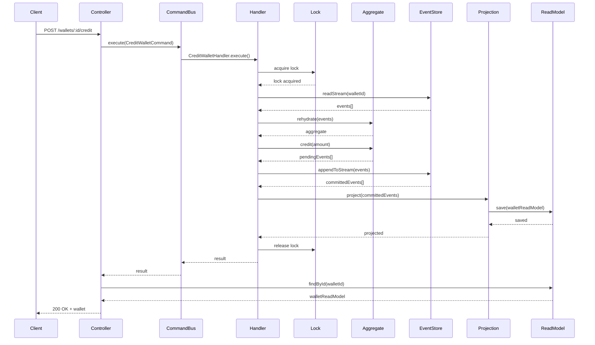
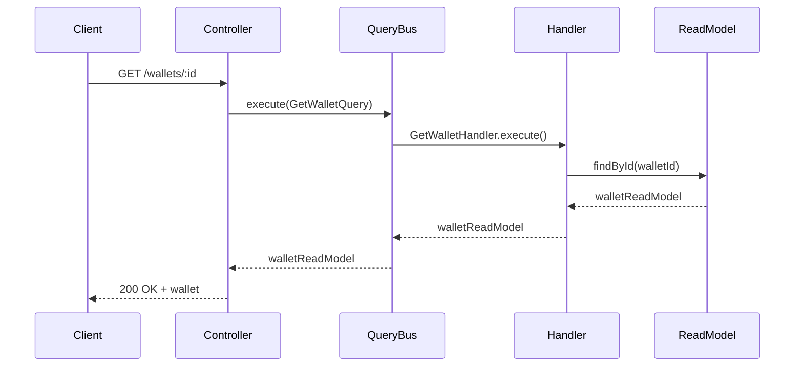

# Wallet Module Documentation

## Table of Contents

1. [Overview](#overview)
2. [Architecture](#architecture)
3. [Directory Structure](#directory-structure)
4. [Domain Layer](#domain-layer)
5. [Application Layer](#application-layer)
6. [Infrastructure Layer](#infrastructure-layer)
7. [Interface Layer](#interface-layer)
8. [Module Configuration](#module-configuration)
9. [Design Patterns](#design-patterns)
10. [Data Flow](#data-flow)
11. [Concurrency Control](#concurrency-control)
12. [Performance Optimizations](#performance-optimizations)
13. [Error Handling](#error-handling)
14. [Testing](#testing)
15. [API Examples](#api-examples)

---

## Overview

The **Wallet Module** is a production-grade wallet management system built with **NestJS**, implementing **Event Sourcing** and **CQRS (Command Query Responsibility Segregation)** patterns. It provides robust wallet operations including creation, credit, debit, and transfers with strong consistency guarantees.

### Key Features

- ✅ **Event Sourcing**: All state changes captured as immutable events in KurrentDB
- ✅ **CQRS Pattern**: Separate command and query paths for optimal performance
- ✅ **Distributed Locking**: Redis-based locks prevent concurrent modification conflicts
- ✅ **Optimistic Locking**: Version-based concurrency control for entities
- ✅ **Snapshot Support**: Performance optimization for long event streams
- ✅ **Read Model Projections**: Fast queries via Elasticsearch
- ✅ **Audit Trail**: Complete transaction history with full traceability
- ✅ **Hold/Reserve System**: Support for fund holds (payment authorizations, escrow)
- ✅ **Transactional Transfers**: Atomic wallet-to-wallet transfers

### Technology Stack

| Component   | Technology            | Purpose                       |
| ----------- | --------------------- | ----------------------------- |
| Framework   | NestJS                | Application framework         |
| Event Store | KurrentDB             | Event sourcing database       |
| Read Model  | Elasticsearch         | Fast query performance        |
| Locking     | Redis                 | Distributed locks             |
| Database    | PostgreSQL (TypeORM)  | Traditional persistence layer |
| Pattern     | CQRS + Event Sourcing | Architecture pattern          |

---

## Architecture

The module follows **Domain-Driven Design (DDD)** principles organized into four distinct layers:

```
┌─────────────────────────────────────────────────────────┐
│                    Interface Layer                       │
│                  (REST Controllers)                      │
└──────────────────────┬──────────────────────────────────┘
                       │
┌──────────────────────▼──────────────────────────────────┐
│                  Application Layer                       │
│        (Commands, Queries, Handlers, Services)          │
└──────────┬─────────────────────────────┬────────────────┘
           │                             │
┌──────────▼──────────┐     ┌───────────▼────────────────┐
│   Domain Layer       │     │  Infrastructure Layer      │
│ (Aggregates, Events, │     │ (Event Store, Projections, │
│  Entities, Errors)   │     │  Read Model, Locks, DB)    │
└──────────────────────┘     └────────────────────────────┘
```

### Event Sourcing Flow

```
Command → Handler → Aggregate → Events → Event Store
                                    │
                                    ├→ Projection Service
                                    │
                                    └→ Read Model (Elasticsearch)
```

---

## Directory Structure

```
wallet/
├── wallet.module.ts                # Module configuration
├── wallet.module.spec.ts          # Module tests
│
├── domain/                        # Domain Layer
│   ├── wallet.aggregate.ts       # Core business logic aggregate
│   ├── events.ts                 # Domain events
│   ├── errors.ts                 # Domain-specific errors
│   └── entities/                 # TypeORM entities
│       ├── wallet.entity.ts      # Wallet persistence entity
│       └── hold.entity.ts        # Hold/reserve entity
│
├── application/                   # Application Layer
│   ├── commands/                 # Write operations
│   │   ├── create-wallet.command.ts
│   │   ├── credit-wallet.command.ts
│   │   ├── debit-wallet.command.ts
│   │   ├── transfer-wallet.command.ts
│   │   └── handlers/
│   │       ├── create-wallet.handler.ts
│   │       ├── credit-wallet.handler.ts
│   │       ├── debit-wallet.handler.ts
│   │       └── transfer-wallet.handler.ts
│   │
│   ├── queries/                  # Read operations
│   │   ├── get-wallet.query.ts
│   │   ├── get-wallets.query.ts
│   │   └── handlers/
│   │       ├── get-wallet.handler.ts
│   │       └── get-wallets.handler.ts
│   │
│   └── retry.helper.ts           # Retry utilities
│
├── infrastructure/                # Infrastructure Layer
│   ├── event-store/              # Event persistence
│   │   ├── event-store.service.ts
│   │   └── kurrentdb.tokens.ts
│   │
│   ├── projections/              # Event projections
│   │   └── wallet-projection.service.ts
│   │
│   ├── read-model/               # Query model
│   │   └── wallet-read.repository.ts
│   │
│   ├── lock/                     # Distributed locking
│   │   └── distributed-lock.service.ts
│   │
│   ├── snapshots/                # Performance optimization
│   │   ├── wallet-snapshot.service.ts
│   │   └── wallet-snapshot.repository.ts
│   │
│   └── persistence/              # Traditional DB access
│       ├── wallet.repository.ts
│       └── hold.repository.ts
│
└── interfaces/                    # Interface Layer
    └── rest/                     # REST API
        ├── wallet.controller.ts
        └── dto/
            ├── create-wallet.dto.ts
            ├── mutate-wallet-balance.dto.ts
            └── transfer-wallet.dto.ts
```

---

## Domain Layer

### Wallet Aggregate

The `WalletAggregate` is the heart of the domain model, encapsulating all business rules and state transitions.

**File:** `domain/wallet.aggregate.ts`

#### Key Responsibilities

- Enforce business invariants
- Generate domain events
- Maintain wallet state
- Support event sourcing patterns (create, rehydrate, snapshot)

#### State Structure

```typescript
interface WalletState {
  id: string;           // Wallet unique identifier
  ownerId: string;      // Owner/user ID
  balance: number;      // Current balance
  createdAt: string;    // Creation timestamp
  updatedAt: string;    // Last update timestamp
  version: number;      // Event version (for concurrency)
}
```

#### Core Methods

##### 1. Create Wallet

```typescript
static create(walletId: string, ownerId: string, initialBalance = 0): WalletAggregate
```

Creates a new wallet aggregate with optional initial balance.

**Business Rules:**
- Initial balance must be >= 0
- Emits `WalletCreated` event
- If initial balance > 0, emits `WalletCredited` event

##### 2. Credit (Add Funds)

```typescript
credit(amount: number, description?: string): void
```

Adds funds to the wallet.

**Business Rules:**
- Amount must be > 0
- Amount must be a finite number
- Emits `WalletCredited` event

##### 3. Debit (Remove Funds)

```typescript
debit(amount: number, description?: string): void
```

Removes funds from the wallet.

**Business Rules:**
- Amount must be > 0
- Amount must be a finite number
- Balance must be sufficient (balance >= amount)
- Throws `InsufficientFundsError` if funds insufficient
- Emits `WalletDebited` event

##### 4. Rehydrate from Events

```typescript
static rehydrate(walletId: string, events: StoredWalletEvent[]): WalletAggregate
```

Reconstructs aggregate state from event history.

##### 5. Rehydrate from Snapshot

```typescript
static rehydrateFromSnapshot(
  walletId: string,
  snapshotState: WalletState,
  snapshotVersion: number,
  eventsAfterSnapshot: StoredWalletEvent[]
): WalletAggregate
```

Optimized rehydration using snapshot + incremental events.

##### 6. Snapshot State

```typescript
snapshot(): WalletState | null
```

Returns current state for snapshot creation.

#### Version Management

The aggregate tracks two version numbers:

- **version**: Current version including pending events
- **persistedVersion**: Last persisted version in event store

This enables optimistic concurrency control.

### Domain Events

**File:** `domain/events.ts`

All wallet state changes are represented as immutable events.

#### Event Types

##### 1. WalletCreated

```typescript
interface WalletCreatedEvent {
  type: 'WalletCreated';
  aggregateId: string;
  data: {
    ownerId: string;
    initialBalance?: number;
  };
}
```

Emitted when a new wallet is created.

##### 2. WalletCredited

```typescript
interface WalletCreditedEvent {
  type: 'WalletCredited';
  aggregateId: string;
  data: {
    amount: number;
    description?: string;
  };
}
```

Emitted when funds are added to a wallet.

##### 3. WalletDebited

```typescript
interface WalletDebitedEvent {
  type: 'WalletDebited';
  aggregateId: string;
  data: {
    amount: number;
    description?: string;
  };
}
```

Emitted when funds are removed from a wallet.

#### Event Metadata

All stored events include metadata:

```typescript
interface EventMetadata {
  version: number;        // Event sequence number
  occurredAt: string;     // Timestamp (ISO 8601)
  correlationId?: string; // Request correlation
  causationId?: string;   // Causing event ID
}
```

### Domain Entities

#### WalletEntity

**File:** `domain/entities/wallet.entity.ts`

TypeORM entity for traditional database persistence (dual write with event sourcing).

**Key Fields:**

```typescript
@Entity('wallets')
export class WalletEntity {
  @PrimaryColumn('uuid')
  id: string;

  @Column('varchar')
  ownerId: string;

  @Column('decimal', { precision: 19, scale: 4 })
  balance: number;

  @Column('decimal', { precision: 19, scale: 4 })
  heldBalance: number;

  @Column('decimal', { precision: 19, scale: 4 })
  availableBalance: number;

  @Column({ type: 'enum', enum: WalletStatus })
  status: WalletStatus;

  @VersionColumn()
  version: number;  // Optimistic locking

  @Column('varchar', { length: 3, default: 'USD' })
  currency: string;

  @Column('jsonb', { nullable: true })
  metadata: Record<string, any> | null;

  @OneToMany(() => HoldEntity, hold => hold.wallet)
  holds: HoldEntity[];
}
```

**Status Enum:**

```typescript
enum WalletStatus {
  ACTIVE = 'ACTIVE',       // Normal operations allowed
  SUSPENDED = 'SUSPENDED', // Temporarily disabled
  CLOSED = 'CLOSED'        // Permanently closed
}
```

**Utility Methods:**

- `calculateAvailableBalance()`: Returns `balance - heldBalance`
- `canDebit(amount)`: Checks if debit is allowed
- `isActive()`: Checks if wallet is active

#### HoldEntity

**File:** `domain/entities/hold.entity.ts`

Represents temporary fund reservations (authorization holds, escrow, etc.).

**Key Fields:**

```typescript
@Entity('holds')
export class HoldEntity {
  @PrimaryGeneratedColumn('uuid')
  id: string;

  @Column('uuid')
  walletId: string;

  @Column('decimal', { precision: 19, scale: 4 })
  amount: number;

  @Column({ type: 'enum', enum: HoldStatus })
  status: HoldStatus;

  @Column({ type: 'enum', enum: HoldType })
  type: HoldType;

  @Column('varchar', { nullable: true })
  reference: string | null;

  @Column('varchar', { nullable: true })
  description: string | null;

  @Column('timestamp', { nullable: true })
  expiresAt: Date | null;

  @Column('timestamp', { nullable: true })
  releasedAt: Date | null;

  @Column('timestamp', { nullable: true })
  capturedAt: Date | null;

  @ManyToOne(() => WalletEntity, wallet => wallet.holds)
  wallet: WalletEntity;
}
```

**Status Enum:**

```typescript
enum HoldStatus {
  ACTIVE = 'ACTIVE',       // Hold is active
  RELEASED = 'RELEASED',   // Hold released (funds available)
  EXPIRED = 'EXPIRED',     // Hold expired
  CAPTURED = 'CAPTURED'    // Hold captured (converted to debit)
}
```

**Type Enum:**

```typescript
enum HoldType {
  PAYMENT = 'PAYMENT',           // Payment authorization
  AUTHORIZATION = 'AUTHORIZATION', // Generic authorization
  REFUND = 'REFUND',             // Refund hold
  ESCROW = 'ESCROW',             // Escrow hold
  OTHER = 'OTHER'                // Other types
}
```

**Utility Methods:**

- `isActive()`: Check if hold is active
- `isExpired()`: Check if hold has expired
- `release()`: Release the hold
- `capture()`: Capture the hold (convert to debit)
- `expire()`: Mark hold as expired

### Domain Errors

**File:** `domain/errors.ts`

Custom error types for domain-specific failures.

#### Error Hierarchy

```typescript
WalletDomainError (base)
├── WalletAlreadyExistsError
├── WalletNotFoundError
├── InsufficientFundsError
├── InvalidAmountError
└── EventConcurrencyError
```

#### Error Details

##### 1. WalletAlreadyExistsError

Thrown when attempting to create a wallet that already exists.

```typescript
throw new WalletAlreadyExistsError(walletId);
// Message: "Wallet {walletId} already exists"
```

##### 2. WalletNotFoundError

Thrown when wallet cannot be found.

```typescript
throw new WalletNotFoundError(walletId);
// Message: "Wallet {walletId} was not found"
```

##### 3. InsufficientFundsError

Thrown when attempting to debit more than available balance.

```typescript
throw new InsufficientFundsError(walletId, balance, amount);
// Message: "Wallet {walletId} has insufficient funds: balance {balance}, attempted debit {amount}"
```

##### 4. InvalidAmountError

Thrown when amount is invalid (negative, zero, NaN, etc.).

```typescript
throw new InvalidAmountError(amount);
// Message: "Amount must be greater than zero. Received: {amount}"
```

##### 5. EventConcurrencyError

Thrown when optimistic locking detects concurrent modification.

```typescript
throw new EventConcurrencyError(expectedVersion, currentVersion);
// Message: "Concurrency conflict detected. Expected version {expectedVersion}, actual {currentVersion}"
```

---

## Application Layer

The application layer orchestrates business operations using the CQRS pattern.

### Commands (Write Operations)

Commands represent intentions to change state.

#### 1. CreateWalletCommand

**File:** `application/commands/create-wallet.command.ts`

```typescript
export class CreateWalletCommand {
  constructor(
    public readonly walletId: string,
    public readonly ownerId: string,
    public readonly initialBalance: number = 0,
  ) {}
}
```

**Handler:** `application/commands/handlers/create-wallet.handler.ts`

**Flow:**

1. Acquire distributed lock for wallet
2. Check if wallet already exists in event store
3. Create new `WalletAggregate`
4. Append events to event store
5. Project events to read model
6. Release lock

**Example:**

```typescript
await commandBus.execute(
  new CreateWalletCommand('wallet-123', 'user-456', 100)
);
```

#### 2. CreditWalletCommand

**File:** `application/commands/credit-wallet.command.ts`

```typescript
export class CreditWalletCommand {
  constructor(
    public readonly walletId: string,
    public readonly amount: number,
    public readonly description?: string,
  ) {}
}
```

**Handler:** `application/commands/handlers/credit-wallet.handler.ts`

**Flow:**

1. Acquire distributed lock
2. Load aggregate (with snapshot optimization)
3. Call `aggregate.credit()`
4. Append events to event store
5. Project events to read model
6. Create snapshot if threshold reached
7. Release lock

#### 3. DebitWalletCommand

**File:** `application/commands/debit-wallet.command.ts`

```typescript
export class DebitWalletCommand {
  constructor(
    public readonly walletId: string,
    public readonly amount: number,
    public readonly description?: string,
  ) {}
}
```

**Handler:** `application/commands/handlers/debit-wallet.handler.ts`

**Flow:** Similar to credit, but calls `aggregate.debit()`.

**Validation:**
- Checks sufficient funds
- Throws `InsufficientFundsError` if balance insufficient

#### 4. TransferWalletCommand

**File:** `application/commands/transfer-wallet.command.ts`

```typescript
export class TransferWalletCommand {
  constructor(
    public readonly fromWalletId: string,
    public readonly toWalletId: string,
    public readonly amount: number,
    public readonly description?: string,
  ) {}
}
```

**Handler:** `application/commands/handlers/transfer-wallet.handler.ts`

**Flow:**

1. Validate source ≠ destination
2. Acquire locks on both wallets **in alphabetical order** (prevents deadlocks)
3. Load both aggregates with snapshot optimization
4. Debit source wallet
5. Credit destination wallet
6. Append events for both wallets
7. Project all events
8. Create snapshots if needed
9. Release locks

**Deadlock Prevention:**

```typescript
const [firstWalletId, secondWalletId] = [fromWalletId, toWalletId].sort();
// Always lock in consistent order
```

### Queries (Read Operations)

Queries retrieve data from the read model (Elasticsearch).

#### 1. GetWalletQuery

**File:** `application/queries/get-wallet.query.ts`

```typescript
export class GetWalletQuery {
  constructor(public readonly walletId: string) {}
}
```

**Handler:** `application/queries/handlers/get-wallet.handler.ts`

Returns single wallet from Elasticsearch read model.

#### 2. GetWalletsQuery

**File:** `application/queries/get-wallets.query.ts`

```typescript
export class GetWalletsQuery {}
```

**Handler:** `application/queries/handlers/get-wallets.handler.ts`

Returns all wallets from Elasticsearch read model.

---

## Infrastructure Layer

### Event Store Service

**File:** `infrastructure/event-store/event-store.service.ts`

Manages event persistence in **KurrentDB**.

#### Key Methods

##### 1. readStream

```typescript
async readStream(aggregateId: string): Promise<StoredWalletEvent[]>
```

Reads all events for a wallet from the beginning.

##### 2. readStreamFromVersion

```typescript
async readStreamFromVersion(
  aggregateId: string,
  fromVersion: number
): Promise<StoredWalletEvent[]>
```

Reads events starting from a specific version (used with snapshots).

##### 3. appendToStream

```typescript
async appendToStream(
  aggregateId: string,
  events: WalletDomainEvent[],
  expectedVersion: number
): Promise<StoredWalletEvent[]>
```

Appends new events with optimistic concurrency control.

**Features:**
- Validates expected version matches current stream version
- Throws `EventConcurrencyError` on version mismatch
- Returns committed events with metadata

**Stream Naming Convention:**

```typescript
streamName = `wallet-${aggregateId}`
```

### Projection Service

**File:** `infrastructure/projections/wallet-projection.service.ts`

Projects events from event store to read model (Elasticsearch).

#### Key Method

```typescript
async project(events: StoredWalletEvent[]): Promise<void>
```

Processes events and updates read model:

- **WalletCreated**: Creates new document in Elasticsearch
- **WalletCredited**: Increases balance, adds audit entry
- **WalletDebited**: Decreases balance, adds audit entry

#### Projection Logic

Each event type updates the read model:

```typescript
// WalletCreated
{
  id: walletId,
  ownerId: ownerId,
  balance: 0,
  version: 0,
  auditTrail: [{ type: 'WalletCreated', occurredAt: timestamp }]
}

// WalletCredited
{
  ...existingDocument,
  balance: balance + amount,
  version: newVersion,
  auditTrail: [...existing, { type: 'WalletCredited', amount, description, occurredAt }]
}

// WalletDebited
{
  ...existingDocument,
  balance: balance - amount,
  version: newVersion,
  auditTrail: [...existing, { type: 'WalletDebited', amount, description, occurredAt }]
}
```

### Read Model Repository

**File:** `infrastructure/read-model/wallet-read.repository.ts`

Manages Elasticsearch index for wallet queries.

#### Read Model Structure

```typescript
interface WalletReadModel {
  id: string;
  ownerId: string;
  balance: number;
  createdAt: string;
  updatedAt: string;
  version: number;
  auditTrail: AuditTrailEntry[];
}

interface AuditTrailEntry {
  type: string;
  amount?: number;
  description?: string;
  occurredAt: string;
}
```

#### Key Methods

##### 1. save

```typescript
async save(model: WalletReadModel): Promise<void>
```

Saves/updates wallet document in Elasticsearch.

**Features:**
- Auto-creates index if not exists
- Uses `refresh: 'wait_for'` for immediate consistency
- Stores full audit trail

##### 2. findById

```typescript
async findById(walletId: string): Promise<WalletReadModel | null>
```

Retrieves wallet by ID.

##### 3. searchByOwner

```typescript
async searchByOwner(ownerId: string): Promise<WalletReadModel[]>
```

Finds all wallets for a specific owner.

##### 4. findAll

```typescript
async findAll(): Promise<WalletReadModel[]>
```

Retrieves all wallets (paginated to 1000 results).

#### Index Mapping

```typescript
{
  properties: {
    id: { type: 'keyword' },
    ownerId: { type: 'keyword' },
    balance: { type: 'double' },
    createdAt: { type: 'date' },
    updatedAt: { type: 'date' },
    version: { type: 'integer' },
    auditTrail: {
      type: 'nested',
      properties: {
        type: { type: 'keyword' },
        amount: { type: 'double' },
        description: { type: 'text' },
        occurredAt: { type: 'date' }
      }
    }
  }
}
```

### Distributed Lock Service

**File:** `infrastructure/lock/distributed-lock.service.ts`

Redis-based distributed locking to prevent concurrent modifications.

#### Key Methods

##### 1. acquire

```typescript
async acquire(key: string, ttlMs: number): Promise<string | null>
```

Attempts to acquire a lock.

**Returns:** Lock token if successful, `null` if failed.

**Implementation:**

```redis
SET key token PX ttlMs NX
```

- **NX**: Only set if key doesn't exist
- **PX**: Set expiration in milliseconds

##### 2. release

```typescript
async release(key: string, token: string): Promise<boolean>
```

Releases a lock (only if token matches).

**Implementation:** Lua script for atomic check-and-delete

```lua
if redis.call("get", KEYS[1]) == ARGV[1] then
  return redis.call("del", KEYS[1])
else
  return 0
end
```

##### 3. acquireWithRetry

```typescript
async acquireWithRetry(
  key: string,
  ttlMs: number,
  maxRetries: number = 100,
  initialRetryDelayMs: number = 10
): Promise<string>
```

Acquires lock with exponential backoff retry.

**Backoff Formula:**

```typescript
delay = min(initialDelay * 1.5^attempt, 500ms) + jitter
jitter = random(0, delay/2)
```

##### 4. withLock

```typescript
async withLock<T>(
  key: string,
  ttlMs: number,
  handler: () => Promise<T>,
  maxRetries: number = 100
): Promise<T>
```

Executes function with lock protection.

**Usage Example:**

```typescript
await lockService.withLock(
  `lock:wallet:${walletId}`,
  5000,  // 5 second TTL
  async () => {
    // Critical section
    // Perform wallet operations
    return result;
  }
);
```

**Lock Key Convention:**

```typescript
`lock:wallet:${walletId}`
```

### Snapshot Service

**File:** `infrastructure/snapshots/wallet-snapshot.service.ts`

Optimizes aggregate rehydration by creating periodic snapshots.

#### Configuration

```typescript
interface SnapshotConfig {
  snapshotThreshold: number;  // Default: 100 events
  keepLastSnapshots: number;  // Default: 3 snapshots
}
```

**Environment Variables:**

- `SNAPSHOT_THRESHOLD`: Events before creating snapshot
- `SNAPSHOT_KEEP_LAST`: Number of old snapshots to retain

#### Key Methods

##### 1. loadAggregate

```typescript
async loadAggregate(walletId: string): Promise<{
  aggregate: WalletAggregate;
  eventCount: number;
} | null>
```

Loads aggregate with snapshot optimization.

**Flow:**

1. Try to load latest snapshot
2. If snapshot exists:
   - Load events after snapshot
   - Rehydrate from snapshot + incremental events
3. If no snapshot:
   - Load all events
   - Rehydrate from full history

**Performance:**

- Without snapshot: Load all N events
- With snapshot: Load only events since snapshot (typically < 100)

##### 2. createSnapshotIfNeeded

```typescript
async createSnapshotIfNeeded(
  aggregate: WalletAggregate,
  eventCount: number
): Promise<void>
```

Creates snapshot when threshold reached.

**Conditions:**

```typescript
eventCount >= threshold && eventCount % threshold === 0
```

**Benefits:**

- Reduces rehydration time for wallets with many events
- Configurable threshold balances storage vs performance
- Automatic cleanup of old snapshots

##### 3. createSnapshot

```typescript
async createSnapshot(walletId: string): Promise<void>
```

Forces immediate snapshot creation (useful for maintenance).

#### Snapshot Structure

```typescript
interface WalletSnapshot {
  aggregateId: string;
  state: WalletState;
  version: number;          // Event version of snapshot
  snapshotVersion: number;  // Snapshot sequence number
  timestamp: string;
}
```

### Persistence Repositories

#### WalletRepository

**File:** `infrastructure/persistence/wallet.repository.ts`

TypeORM-based repository for traditional database operations.

**Key Methods:**

- `create()`: Create new wallet
- `findById()`: Find wallet by ID
- `findByOwnerId()`: Find wallets by owner
- `credit()`: Add funds (with pessimistic locking)
- `debit()`: Remove funds (with pessimistic locking)
- `transfer()`: Atomic transfer between wallets
- `updateHeldBalance()`: Update held funds

**Locking Strategy:**

```typescript
// Pessimistic write lock during transaction
const wallet = await repo.findOne({
  where: { id: walletId },
  lock: { mode: 'pessimistic_write' }
});
```

#### HoldRepository

**File:** `infrastructure/persistence/hold.repository.ts`

Manages hold/reservation operations.

**Key Methods:**

- `create()`: Create new hold
- `findById()`: Find hold by ID
- `findByWalletId()`: Find all holds for wallet
- `release()`: Release hold
- `capture()`: Capture hold
- `expire()`: Expire hold
- `findActiveByWalletId()`: Find active holds

---

## Interface Layer

### Wallet Controller

**File:** `interfaces/rest/wallet.controller.ts`

REST API endpoints for wallet operations.

#### Endpoints

##### 1. Create Wallet

```typescript
POST /wallets

Body:
{
  "walletId": "wallet-123",
  "ownerId": "user-456",
  "initialBalance": 100
}

Response: 201 Created
{
  "id": "wallet-123",
  "ownerId": "user-456",
  "balance": 100,
  "version": 1,
  "createdAt": "2025-10-29T...",
  "updatedAt": "2025-10-29T...",
  "auditTrail": [...]
}
```

##### 2. Credit Wallet

```typescript
POST /wallets/:walletId/credit

Body:
{
  "amount": 50,
  "description": "Deposit"
}

Response: 200 OK
{
  "id": "wallet-123",
  "balance": 150,
  "version": 2,
  ...
}
```

##### 3. Debit Wallet

```typescript
POST /wallets/:walletId/debit

Body:
{
  "amount": 30,
  "description": "Withdrawal"
}

Response: 200 OK
{
  "id": "wallet-123",
  "balance": 120,
  "version": 3,
  ...
}
```

##### 4. Transfer

```typescript
POST /wallets/:fromWalletId/transfer

Body:
{
  "toWalletId": "wallet-789",
  "amount": 25,
  "description": "Payment"
}

Response: 200 OK
{
  "fromWallet": { ... },
  "toWallet": { ... }
}
```

##### 5. Get Wallet

```typescript
GET /wallets/:walletId

Response: 200 OK
{
  "id": "wallet-123",
  "balance": 95,
  "version": 4,
  "auditTrail": [
    {
      "type": "WalletCreated",
      "occurredAt": "..."
    },
    {
      "type": "WalletCredited",
      "amount": 100,
      "description": "Initial balance",
      "occurredAt": "..."
    },
    ...
  ]
}
```

##### 6. Get All Wallets

```typescript
GET /wallets

Response: 200 OK
[
  { "id": "wallet-123", ... },
  { "id": "wallet-789", ... }
]
```

#### Error Handling

The controller maps domain errors to HTTP status codes:

| Domain Error               | HTTP Status     | Description             |
| -------------------------- | --------------- | ----------------------- |
| `WalletAlreadyExistsError` | 409 Conflict    | Wallet already exists   |
| `WalletNotFoundError`      | 404 Not Found   | Wallet not found        |
| `InsufficientFundsError`   | 400 Bad Request | Insufficient funds      |
| `InvalidAmountError`       | 400 Bad Request | Invalid amount          |
| `EventConcurrencyError`    | 409 Conflict    | Concurrent modification |

### DTOs

#### CreateWalletDto

```typescript
export class CreateWalletDto {
  @IsString()
  @IsNotEmpty()
  walletId: string;

  @IsString()
  @IsNotEmpty()
  ownerId: string;

  @IsNumber()
  @IsOptional()
  @Min(0)
  initialBalance?: number;
}
```

#### MutateWalletBalanceDto

```typescript
export class MutateWalletBalanceDto {
  @IsNumber()
  @IsPositive()
  amount: number;

  @IsString()
  @IsOptional()
  description?: string;
}
```

#### TransferWalletDto

```typescript
export class TransferWalletDto {
  @IsString()
  @IsNotEmpty()
  toWalletId: string;

  @IsNumber()
  @IsPositive()
  amount: number;

  @IsString()
  @IsOptional()
  description?: string;
}
```

---

## Module Configuration

**File:** `wallet.module.ts`

### Providers

The module configures the following providers:

#### 1. KurrentDB Connection

```typescript
{
  provide: KURRENTDB_CONNECTION,
  useFactory: () => KurrentDBClient.connectionString(
    process.env.KURRENTDB_CONNECTION_STRING ?? 
    'kurrentdb://localhost:2113?tls=false'
  )
}
```

#### 2. Elasticsearch Client

```typescript
{
  provide: ELASTICSEARCH_CLIENT,
  useFactory: () => new Client({
    node: process.env.ELASTICSEARCH_NODE ?? 'http://localhost:9200',
    auth: {
      apiKey: process.env.ELASTICSEARCH_API_KEY,
      // or username/password
    }
  })
}
```

#### 3. Command Handlers

- `CreateWalletHandler`
- `CreditWalletHandler`
- `DebitWalletHandler`
- `TransferWalletHandler`

#### 4. Query Handlers

- `GetWalletHandler`
- `GetWalletsHandler`

#### 5. Infrastructure Services

- `EventStoreDbService`: Event persistence
- `WalletProjectionService`: Event projection
- `WalletReadRepository`: Read model access
- `DistributedLockService`: Redis locking
- `WalletSnapshotService`: Snapshot management
- `WalletSnapshotRepository`: Snapshot persistence
- `WalletRepository`: Traditional DB access
- `HoldRepository`: Hold management

### Imports

- `CqrsModule`: CQRS infrastructure from NestJS
- `TypeOrmModule.forFeature([WalletEntity, HoldEntity])`: TypeORM entities

### Exports

Exported for use in other modules:

- `WalletReadRepository`: Query wallet read models
- `WalletRepository`: Traditional DB operations
- `HoldRepository`: Hold management

---

## Design Patterns

### 1. Event Sourcing

All wallet state changes are captured as immutable events.

**Benefits:**

- Complete audit trail
- Time travel (replay events to any point)
- Event replay for debugging
- Multiple projections from same events

**Implementation:**

```typescript
// Instead of updating balance directly:
wallet.balance += amount; // ❌

// We emit events:
wallet.credit(amount); // ✅
// → Emits WalletCredited event
// → Event stored in KurrentDB
// → Event projected to Elasticsearch
```

### 2. CQRS (Command Query Responsibility Segregation)

Separate paths for writes (commands) and reads (queries).

**Write Path (Commands):**

```
Command → Handler → Aggregate → Events → Event Store → Projection
```

**Read Path (Queries):**

```
Query → Handler → Read Repository → Elasticsearch
```

**Benefits:**

- Optimized read and write models
- Independent scaling
- Better performance

### 3. Aggregate Pattern

`WalletAggregate` encapsulates business logic and maintains consistency boundary.

**Responsibilities:**

- Enforce invariants
- Generate events
- Maintain state

**Rules:**

- One aggregate = one consistency boundary
- Transactions don't span aggregates
- Aggregates communicate via events

### 4. Repository Pattern

Abstracts data access behind interfaces.

**Implementations:**

- `EventStoreDbService`: Event stream access
- `WalletReadRepository`: Elasticsearch access
- `WalletRepository`: PostgreSQL access
- `WalletSnapshotRepository`: Snapshot storage

### 5. Distributed Lock Pattern

Prevents concurrent modifications using Redis locks.

**Usage:**

```typescript
await lockService.withLock(
  `lock:wallet:${walletId}`,
  5000,
  async () => {
    // Critical section
  }
);
```

### 6. Snapshot Pattern

Performance optimization for long event streams.

**Without Snapshots:**

```
Load wallet → Read 10,000 events → Apply all → Slow! ❌
```

**With Snapshots:**

```
Load wallet → Read snapshot (at event 9,900) → Read 100 events → Fast! ✅
```

### 7. Optimistic Concurrency Control

Version-based conflict detection.

**Flow:**

```typescript
// Read aggregate
const aggregate = await load(walletId); // version = 5

// Modify aggregate
aggregate.credit(100);

// Try to save with expected version
await save(aggregate, expectedVersion: 5);
// → If current version != 5, throw EventConcurrencyError
```

---

## Data Flow

### Write Operation Flow



### Read Operation Flow



---

## Concurrency Control

### Two-Level Protection

#### 1. Distributed Locks (Redis)

**Purpose:** Prevent concurrent command execution for same aggregate.

**Scope:** Application-level (across multiple instances)

**Mechanism:**

```typescript
await lockService.withLock(`lock:wallet:${walletId}`, 5000, async () => {
  // Only one instance can execute at a time
});
```

**Benefits:**

- Prevents race conditions
- Supports distributed deployments
- Automatic retry with exponential backoff

#### 2. Optimistic Locking (Event Store)

**Purpose:** Detect concurrent modifications at event store level.

**Scope:** Data-level (within event stream)

**Mechanism:**

```typescript
await eventStore.appendToStream(
  walletId,
  events,
  expectedVersion: 5  // Must match current stream version
);
```

**Benefits:**

- Guarantees event stream consistency
- Detects conflicts even if locks fail
- Database-level protection

### Transfer Deadlock Prevention

When locking multiple wallets, always lock in consistent order:

```typescript
const [firstWalletId, secondWalletId] = [fromWalletId, toWalletId].sort();

await lockService.withLock(`lock:wallet:${firstWalletId}`, 5000, async () => {
  await lockService.withLock(`lock:wallet:${secondWalletId}`, 5000, async () => {
    // Both wallets locked in alphabetical order
    // Prevents circular wait (deadlock)
  });
});
```

---

## Performance Optimizations

### 1. Snapshots

Reduces rehydration time for wallets with many events.

**Configuration:**

```bash
SNAPSHOT_THRESHOLD=100      # Create snapshot every 100 events
SNAPSHOT_KEEP_LAST=3        # Keep last 3 snapshots
```

**Performance Impact:**

| Event Count | Without Snapshot | With Snapshot | Improvement |
| ----------- | ---------------- | ------------- | ----------- |
| 100         | 50ms             | 50ms          | 0%          |
| 500         | 250ms            | 50ms          | 80%         |
| 1,000       | 500ms            | 50ms          | 90%         |
| 10,000      | 5,000ms          | 50ms          | 99%         |

### 2. Read Model (Elasticsearch)

Queries served from optimized read model instead of replaying events.

**Without Read Model:**

```
Query → Read all events → Replay → Build state → Return
```

**With Read Model:**

```
Query → Elasticsearch → Return (sub-millisecond)
```

### 3. Distributed Locking with Retry

Exponential backoff prevents thundering herd.

```typescript
// Initial delay: 10ms
// Attempt 1: wait 10ms
// Attempt 2: wait 15ms
// Attempt 3: wait 22ms
// ...
// Max: 500ms
```

### 4. Index Optimization

Elasticsearch mappings optimized for common queries:

- `ownerId`: Keyword (exact match)
- `balance`: Double (range queries)
- `createdAt`, `updatedAt`: Date (temporal queries)
- `auditTrail`: Nested (complex queries)

---

## Error Handling

### Domain Errors

All domain errors extend `WalletDomainError`:

```typescript
try {
  await commandBus.execute(new DebitWalletCommand(walletId, 1000));
} catch (error) {
  if (error instanceof InsufficientFundsError) {
    // Handle insufficient funds
  } else if (error instanceof WalletNotFoundError) {
    // Handle wallet not found
  } else if (error instanceof InvalidAmountError) {
    // Handle invalid amount
  }
}
```

### Controller Error Mapping

The controller automatically maps domain errors to HTTP responses:

```typescript
private handleError(error: unknown): never {
  if (error instanceof WalletAlreadyExistsError ||
      error instanceof EventConcurrencyError) {
    throw new ConflictException(error.message);
  }
  
  if (error instanceof WalletNotFoundError) {
    throw new NotFoundException(error.message);
  }
  
  if (error instanceof InvalidAmountError ||
      error instanceof InsufficientFundsError) {
    throw new BadRequestException(error.message);
  }
  
  throw error;
}
```

### Retry Strategy

Lock acquisition uses exponential backoff:

```typescript
const token = await lockService.acquireWithRetry(
  key,
  ttl: 5000,
  maxRetries: 100,
  initialDelay: 10
);
```

**Total wait time:** Up to ~10 seconds before throwing error.

---

## Testing

### Unit Tests

Test domain logic in isolation:

```typescript
describe('WalletAggregate', () => {
  it('should credit wallet correctly', () => {
    const aggregate = WalletAggregate.create('w1', 'u1', 100);
    aggregate.credit(50, 'Test credit');
    
    const state = aggregate.snapshot();
    expect(state?.balance).toBe(150);
    
    const events = aggregate.getPendingEvents();
    expect(events).toHaveLength(2); // WalletCreated + WalletCredited
    expect(events[1].type).toBe('WalletCredited');
  });
  
  it('should throw error on insufficient funds', () => {
    const aggregate = WalletAggregate.create('w1', 'u1', 50);
    
    expect(() => {
      aggregate.debit(100, 'Over limit');
    }).toThrow(InsufficientFundsError);
  });
});
```

### Integration Tests

Test complete command/query flow:

```typescript
describe('WalletModule', () => {
  let commandBus: CommandBus;
  let queryBus: QueryBus;
  
  beforeEach(async () => {
    const module = await Test.createTestingModule({
      imports: [WalletModule],
    }).compile();
    
    commandBus = module.get(CommandBus);
    queryBus = module.get(QueryBus);
  });
  
  it('should create and query wallet', async () => {
    // Create
    await commandBus.execute(
      new CreateWalletCommand('w1', 'u1', 100)
    );
    
    // Query
    const wallet = await queryBus.execute(
      new GetWalletQuery('w1')
    );
    
    expect(wallet.balance).toBe(100);
    expect(wallet.ownerId).toBe('u1');
  });
});
```

### Load Testing

See `scripts/` directory for load testing tools:

```bash
# Credit operations
./scripts/spam-credit.sh wallet-123 1000

# Debit operations
./scripts/spam-debit.sh wallet-123 1000

# Mixed operations
./scripts/mixed-load-test.sh wallet-123 5000
```

---

## API Examples

### Example 1: Create Wallet with Initial Balance

```bash
curl -X POST http://localhost:3000/wallets \
  -H "Content-Type: application/json" \
  -d '{
    "walletId": "wallet-user-001",
    "ownerId": "user-001",
    "initialBalance": 1000
  }'
```

**Response:**

```json
{
  "id": "wallet-user-001",
  "ownerId": "user-001",
  "balance": 1000,
  "createdAt": "2025-10-29T12:00:00.000Z",
  "updatedAt": "2025-10-29T12:00:00.000Z",
  "version": 1,
  "auditTrail": [
    {
      "type": "WalletCreated",
      "description": "Wallet created",
      "occurredAt": "2025-10-29T12:00:00.000Z"
    },
    {
      "type": "WalletCredited",
      "amount": 1000,
      "description": "Initial balance",
      "occurredAt": "2025-10-29T12:00:00.001Z"
    }
  ]
}
```

### Example 2: Credit Wallet

```bash
curl -X POST http://localhost:3000/wallets/wallet-user-001/credit \
  -H "Content-Type: application/json" \
  -d '{
    "amount": 500,
    "description": "Monthly salary deposit"
  }'
```

**Response:**

```json
{
  "id": "wallet-user-001",
  "ownerId": "user-001",
  "balance": 1500,
  "updatedAt": "2025-10-29T12:05:00.000Z",
  "version": 2,
  "auditTrail": [
    { ... },
    {
      "type": "WalletCredited",
      "amount": 500,
      "description": "Monthly salary deposit",
      "occurredAt": "2025-10-29T12:05:00.000Z"
    }
  ]
}
```

### Example 3: Debit Wallet

```bash
curl -X POST http://localhost:3000/wallets/wallet-user-001/debit \
  -H "Content-Type: application/json" \
  -d '{
    "amount": 200,
    "description": "ATM withdrawal"
  }'
```

**Response:**

```json
{
  "id": "wallet-user-001",
  "balance": 1300,
  "version": 3,
  ...
}
```

### Example 4: Transfer Between Wallets

```bash
# First create second wallet
curl -X POST http://localhost:3000/wallets \
  -H "Content-Type: application/json" \
  -d '{
    "walletId": "wallet-user-002",
    "ownerId": "user-002",
    "initialBalance": 500
  }'

# Then transfer
curl -X POST http://localhost:3000/wallets/wallet-user-001/transfer \
  -H "Content-Type: application/json" \
  -d '{
    "toWalletId": "wallet-user-002",
    "amount": 300,
    "description": "Payment for services"
  }'
```

**Response:**

```json
{
  "fromWallet": {
    "id": "wallet-user-001",
    "balance": 1000,
    "version": 4,
    ...
  },
  "toWallet": {
    "id": "wallet-user-002",
    "balance": 800,
    "version": 2,
    ...
  }
}
```

### Example 5: Query Wallet

```bash
curl http://localhost:3000/wallets/wallet-user-001
```

**Response:**

```json
{
  "id": "wallet-user-001",
  "ownerId": "user-001",
  "balance": 1000,
  "version": 4,
  "auditTrail": [
    {
      "type": "WalletCreated",
      "occurredAt": "2025-10-29T12:00:00.000Z"
    },
    {
      "type": "WalletCredited",
      "amount": 1000,
      "description": "Initial balance",
      "occurredAt": "2025-10-29T12:00:00.001Z"
    },
    {
      "type": "WalletCredited",
      "amount": 500,
      "description": "Monthly salary deposit",
      "occurredAt": "2025-10-29T12:05:00.000Z"
    },
    {
      "type": "WalletDebited",
      "amount": 200,
      "description": "ATM withdrawal",
      "occurredAt": "2025-10-29T12:10:00.000Z"
    },
    {
      "type": "WalletDebited",
      "amount": 300,
      "description": "Payment for services",
      "occurredAt": "2025-10-29T12:15:00.000Z"
    }
  ]
}
```

### Error Examples

#### Insufficient Funds

```bash
curl -X POST http://localhost:3000/wallets/wallet-user-001/debit \
  -H "Content-Type: application/json" \
  -d '{"amount": 10000}'
```

**Response: 400 Bad Request**

```json
{
  "statusCode": 400,
  "message": "Wallet wallet-user-001 has insufficient funds: balance 1000, attempted debit 10000",
  "error": "Bad Request"
}
```

#### Wallet Not Found

```bash
curl http://localhost:3000/wallets/non-existent-wallet
```

**Response: 404 Not Found**

```json
{
  "statusCode": 404,
  "message": "Wallet non-existent-wallet not found",
  "error": "Not Found"
}
```

#### Wallet Already Exists

```bash
curl -X POST http://localhost:3000/wallets \
  -H "Content-Type: application/json" \
  -d '{
    "walletId": "wallet-user-001",
    "ownerId": "user-001"
  }'
```

**Response: 409 Conflict**

```json
{
  "statusCode": 409,
  "message": "Wallet wallet-user-001 already exists",
  "error": "Conflict"
}
```

---

## Best Practices

### 1. Always Use Commands for Writes

```typescript
// ❌ Don't bypass command bus
await walletRepository.credit(walletId, 100);

// ✅ Use command bus
await commandBus.execute(new CreditWalletCommand(walletId, 100));
```

### 2. Always Use Queries for Reads

```typescript
// ❌ Don't query event store directly
const events = await eventStore.readStream(walletId);

// ✅ Use query bus (read from optimized read model)
const wallet = await queryBus.execute(new GetWalletQuery(walletId));
```

### 3. Handle Concurrency Errors

```typescript
try {
  await commandBus.execute(command);
} catch (error) {
  if (error instanceof EventConcurrencyError) {
    // Retry the operation
    await retryOperation(command);
  }
  throw error;
}
```

### 4. Use Descriptive Event Data

```typescript
// ❌ Generic description
wallet.credit(100, 'Credit');

// ✅ Descriptive
wallet.credit(100, 'Monthly salary deposit - October 2025');
```

### 5. Monitor Snapshot Performance

```typescript
// Check if snapshots are being created
console.log('Wallet loaded with', eventCount, 'events');

// Adjust threshold if needed
SNAPSHOT_THRESHOLD=50  # More frequent snapshots for high-activity wallets
```

### 6. Lock Only What You Need

```typescript
// ❌ Lock too broad
await lockService.withLock('global-wallet-lock', ...)

// ✅ Lock specific resource
await lockService.withLock(`lock:wallet:${walletId}`, ...)
```

### 7. Clean Up Test Data

```typescript
afterEach(async () => {
  // Clean up Elasticsearch
  await elasticsearchClient.indices.delete({
    index: 'test-wallet-*'
  });
  
  // Clean up KurrentDB
  // (typically done via docker-compose down -v)
});
```

---

## Troubleshooting

### Issue: Events Not Appearing in Read Model

**Symptoms:** Wallet shows in event store but not in Elasticsearch.

**Solution:**

1. Check projection service logs
2. Verify Elasticsearch is running: `curl http://localhost:9200`
3. Check index exists: `curl http://localhost:9200/wallet-read-models`
4. Manually trigger projection:

```typescript
const events = await eventStore.readStream(walletId);
await projectionService.project(events);
```

### Issue: Lock Timeout Errors

**Symptoms:** `Failed to acquire lock after N attempts`

**Solution:**

1. Check Redis is running: `redis-cli ping`
2. Increase TTL or max retries:

```typescript
await lockService.withLock(key, 10000, handler, 200);
```

3. Check for deadlocks in logs
4. Ensure locks are always released (use try-finally)

### Issue: Concurrency Conflicts

**Symptoms:** `EventConcurrencyError: Expected version X, actual Y`

**Solution:**

1. This is normal under high load
2. Implement retry logic in client
3. Reduce concurrent operations
4. Check distributed locks are working

### Issue: Slow Wallet Loading

**Symptoms:** High latency on commands

**Solution:**

1. Check event count: Query event store
2. Create snapshot manually:

```typescript
await snapshotService.createSnapshot(walletId);
```

3. Adjust snapshot threshold:

```bash
SNAPSHOT_THRESHOLD=50
```

4. Monitor snapshot service logs

---

## Environment Variables

| Variable                      | Default                                | Description              |
| ----------------------------- | -------------------------------------- | ------------------------ |
| `KURRENTDB_CONNECTION_STRING` | `kurrentdb://localhost:2113?tls=false` | KurrentDB connection     |
| `ELASTICSEARCH_NODE`          | `http://localhost:9200`                | Elasticsearch endpoint   |
| `ELASTICSEARCH_API_KEY`       | -                                      | Elasticsearch API key    |
| `ELASTICSEARCH_USERNAME`      | -                                      | Elasticsearch username   |
| `ELASTICSEARCH_PASSWORD`      | -                                      | Elasticsearch password   |
| `ELASTICSEARCH_WALLET_INDEX`  | `wallet-read-models`                   | Elasticsearch index name |
| `REDIS_HOST`                  | `localhost`                            | Redis host               |
| `REDIS_PORT`                  | `6379`                                 | Redis port               |
| `SNAPSHOT_THRESHOLD`          | `100`                                  | Events before snapshot   |
| `SNAPSHOT_KEEP_LAST`          | `3`                                    | Snapshots to retain      |

---

## Further Reading

### Internal Documentation

- Main README: `../README.md`
- Database Migrations: `../database/README.md`
- Load Testing: `../scripts/README.md`

### External Resources

- [Event Sourcing Pattern](https://martinfowler.com/eaaDev/EventSourcing.html)
- [CQRS Pattern](https://martinfowler.com/bliki/CQRS.html)
- [Domain-Driven Design](https://domainlanguage.com/ddd/)
- [KurrentDB Documentation](https://docs.eventstore.com/)
- [NestJS CQRS](https://docs.nestjs.com/recipes/cqrs)
- [Elasticsearch](https://www.elastic.co/guide/en/elasticsearch/reference/current/index.html)

---

## Contributing

When contributing to the wallet module:

1. Follow DDD principles: Keep domain logic pure
2. Write tests for all new features
3. Update this documentation
4. Ensure backward compatibility with events
5. Test concurrency scenarios
6. Profile performance impact

---

## License

MIT

---

**Last Updated:** October 29, 2025

**Module Version:** 1.0.0

**Maintainer:** Wallex Team

